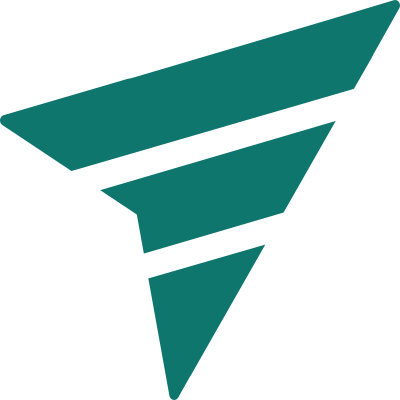

# fael.tech — Identidade Visual

**Forward through technology — technology is not the destination, it's how we move forward.**

Kit completo da marca fael.tech (v3.0), pronto para uso em novos projetos. Esta pasta é a fonte
única de verdade da marca — não é modificada a partir do restante do site sem confirmação prévia.

## Conteúdo

| Arquivo | Uso |
|---|---|
| `manual-identidade-visual.html` | O manual completo — abra no navegador (imprimível em PDF) |
| `tokens.css` | Tokens de marca (escala teal, neutros, liquid glass, fontes) — importe em qualquer projeto |
| `assets/faeltech-mark.svg` | Ponteiro sem círculo, teal `#0F766E` — uso padrão em fundo claro |
| `assets/faeltech-mark-dark.svg` | Ponteiro sem círculo, `#2DD4BF` — fundos escuros |
| `assets/faeltech-mark-ink.svg` | Ponteiro sem círculo, 1 cor tinta `#111827` — impressão, carimbo |
| `assets/faeltech-mark-white.svg` | Ponteiro sem círculo, branco — sobre foto ou teal chapado |
| `assets/faeltech-mark-circle.svg` | Ponteiro com círculo, teal — símbolo isolado e lockups verticais |
| `assets/faeltech-mark-circle-dark.svg` | Ponteiro com círculo, `#2DD4BF` — fundos escuros |
| `assets/faeltech-mark-circle-white.svg` | Ponteiro com círculo, branco — sobre foto ou teal chapado |
| `assets/faeltech-favicon.svg` | Ponteiro com círculo — favicon ≤ 32px |
| `assets/faeltech-app-icon.svg` | App icon 512×512 — tinta + ponteiro com círculo em teal claro |

## Uso rápido

```html
<link rel="stylesheet" href="tokens.css">
<link rel="icon" href="assets/faeltech-favicon.svg">

<!-- lockup horizontal -->
<div style="display:flex;align-items:center;gap:14px">
  
  <span style="font:700 30px var(--ft-font-sans);letter-spacing:var(--ft-tracking-tight)">
    fael<span style="color:var(--ft-teal)">.tech</span>
  </span>
</div>
```

## Conceito

O símbolo reúne seis leituras: o **ponteiro** (ação/interação), as iniciais **F e T** (autoria —
também lidas como Forward Through Technology), a **nave** cruzando uma órbita (exploração), a
**trajetória ascendente** (progresso), o **círculo** (contexto/órbita) e o **símbolo sem círculo**
(ação em curso, usado ao lado do wordmark). Três ideias centrais orientam a marca: **Direction,
Motion, Impact.**

## Regras essenciais

- Uma cor de marca por aplicação. O símbolo é sempre chapado — sem gradientes, transparência ou rotação.
- **Liquid glass**: superfícies translúcidas via classe `.ft-glass` / `.ft-glass--dark`; só em contêineres, nunca no símbolo. Um nível de vidro por composição. "O ambiente muda. A direção permanece clara."
- O único gradiente da identidade é `--ft-depth-bg`, sempre atrás do vidro.
- O círculo nunca é recolorido separadamente do ponteiro — ambos usam sempre a mesma cor.
- Área de proteção: metade da altura do símbolo em todos os lados.
- Fontes: IBM Plex Sans (interface e wordmark) + JetBrains Mono (tagline, comandos).

Ver o manual completo em [manual-identidade-visual.html](manual-identidade-visual.html) para todas
as regras, specimens e a tabela de assets.
